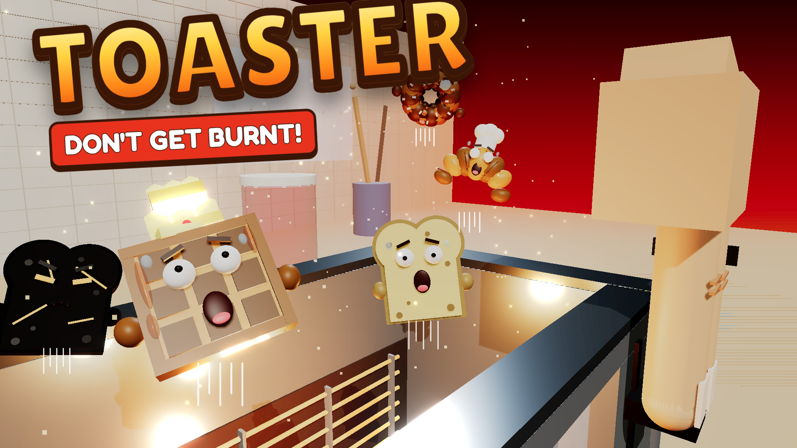

# TOASTER 🍞

You are a slice of bread trapped inside a giant toaster. Survive the heat, collect crumbs, use butter, avoid chaos, and get launched into the air when the toaster finally pops.



A complete, playable Roblox prototype. Everything is built from code with no hand-made models: the map, the bread characters, the giant hand, the fork boss, Crumb World and all of the UI.

## Play it

**Quickest:** open `build/Toaster.rbxlx` in Roblox Studio and press **Play** (or **Test → Start** with 2–4 players to try multiplayer).

**With Rojo (for development):**

```bash
rojo serve            # then connect from the Rojo Studio plugin
rojo build -o build/Toaster.rbxlx   # rebuild the place file
```

Then do the manual steps in [Manual setup](#manual-setup-studio--dashboard).

## The round (≈90 s of play, all times in `src/shared/Config.luau`)

| Phase | What happens |
|---|---|
| `LOBBY` | Wait on the plate until enough players are ready, then a 10 s countdown. |
| `ROUND_START` | Everyone is teleported to distinct spawn points inside the toaster. |
| `CALM_PHASE` (45 s) | Collect **crumbs** (currency) and **butter** (heat shield). The secret crack to Crumb World is open. In the last 10 s the toaster clicks, coils flicker and the camera trembles. |
| `HEATING_PHASE` (25 s) | **The giant hand** (two fingers and a bit of palm) appears, pauses, then pulls the lever down, with a short skippable cinematic. The coils glow and heat rises: ×2 near the coils, ×1 in the centre, ×0.5 in the cool spots. Random telegraphed events: falling food and junk, hot spots, steam bursts, toaster shakes, falling butter. Sometimes **the Giant Fork** shows up and zaps the floor. |
| `LAUNCH_PHASE` (4 s) | `3… 2… 1… POP!` Run to the glowing **POP pad**. Anyone who isn't burnt is turned **golden** (+250). |
| `LANDING_PHASE` | Controlled ballistic launch onto the landing target: JACKPOT 500 / PERFECT 100 / GREAT 50 / GOOD 25 / SAFE 10. The centre of the toaster aims at the bullseye; the POP pad always lands PERFECT or better. |
| `REWARDS` → `RESULTS` | Crumbs and XP are granted once per player, then the results screen shows. Everyone returns to the lobby. |

**Faces react to the heat:** every bread smiles when fresh, gets uneasy when warm, sweats when very hot and screams at critical heat. Charcoal glares with glowing ember eyes and cracks; golden survivors grin.

**Survival streaks and awards:** surviving rounds in a row multiplies your round crumbs (+10% per extra round, up to +50%). At the end of each round the standout players win MOST CRUMBS, BULLSEYE, CHARCOAL MENACE and COOLEST HEAD (+25 crumbs each).

**Burnt?** At 100 heat you become **Charcoal**: slow, smoking, can't use abilities or spreads, but touching other bread *blackens* them and adds a little heat. Charcoal lasts for the rest of the round and the next one.

## Controls (PC / gamepad / touch buttons on screen)

| Action | PC | Gamepad | Touch |
|---|---|---|---|
| Bread ability | Q | X | ✨ button |
| Butter shield | F | Y | 🧈 button |
| Throw jam (sticks a player in place) | E | R1 | 🍓 button |
| Throw Nutella (slippery puddle) | R | L1 | 🍫 button |
| Shop | B | D-pad up | 🛒 button |

## Progression

* **Breads** are bought with crumbs and gated by level:
  * Bread Slice: no ability.
  * Bagel (lvl 2): **Roll**.
  * Croissant (lvl 4): **Flake Trail**, which makes other players slip.
  * LEGENDARY WAFFLE (lvl 7): **Waffle Slam**, a shockwave plus brief heat resistance.
* **Cosmetics** (hats, trails) are purely visual.
* **Titles** come from achievements: TOAST ROOKIE, BUTTER SURVIVOR, CRUMB COLLECTOR, MASTER TOAST, CHARCOAL MENACE, WAFFLE LEGEND and CRUMB ARCHAEOLOGIST.
* **Crumb World:** slip through the dark crack near the west cool spot during the calm phase. Talk to **Old Crumb (est. 1987)** and find his three vintage crumbs. One is on the Butter Inn roof; climb the sugar cubes.
* **Monetization** is cosmetic only (VIP crown/trail, a trail product). Breads, crumbs and anything competitive can't be bought with Robux.

## Architecture

```
src/
  Bootstrap.server.luau        → ServerScriptService.Bootstrap (builds map, inits + starts managers)
  server/                      → ServerScriptService.Server
    RoundManager               state machine (LOBBY … RESULTS), abort when everyone leaves
    PlayerManager              sessions, spawning/respawning, bread appearance, teleports, burning
    HeatManager                fixed-interval heat ticks, zones, butter shield, charcoal touch
    PickupManager              crumbs/butter (server-validated Touched, pooled respawns)
    LaunchManager              controlled ballistic POP, server-owned flight, landing + fallback
    RewardManager              once-per-round rewards, results rows
    AbilityManager             abilities + spreads, all requests validated and rate limited
    EventManager               telegraphed random events + the Giant Fork
    CrumbWorldManager          secret area, Old Crumb dialogue, vintage-crumb quest
    ShopManager                breads/cosmetics/titles, game pass + ProcessReceipt
    AchievementManager         titles from statistics
    DataManager                DataStore load/save with retries, corruption backup, autosave, BindToClose
    CurrencyManager            reusable currency grants/spends
    MapBuilder                 the whole world from primitive parts
    Messaging                  remote helpers (notify, effects, sounds)
  shared/                      → ReplicatedStorage.Shared
    Config                     every timer/rate/reward (no magic numbers elsewhere)
    Constants, Theme, Sounds, Net
    BreadDefinitions, AbilityDefinitions, CosmeticDefinitions, AchievementDefinitions, Monetization
    HeatMath, LandingMath, DataSchema, Progression, RateLimiter, ForkPath   (pure, unit-tested)
    BreadVisuals               procedural bread bodies welded to a normal humanoid
    Maid                       connection/instance lifecycle
  client/                      → StarterPlayerScripts
    ClientController           entry point
    Controllers/UIController, EffectsController, InputController, CameraController, SoundController, UIUtil
```

**Server authority:**
* Clients only *request* actions through `AbilityEvent` / `InteractionEvent`.
* The server validates the player, round phase, distance, cooldowns, ownership and arguments, with a token-bucket rate limit, and decides every outcome.
* Heat, currency, rewards, scores, landing and progression never trust the client.
* During the launch the server takes network ownership of each character, so the landing is authoritative.

**Replication:**
* Round state lives in `ReplicatedStorage.RoundState` attributes (phase, end time).
* Per-player state lives in player attributes (heat, butter, crumbs, cooldowns).
* One-shot moments travel over `RoundEvent`, `UIEvent` and `EffectEvent`, and clients render all transient VFX locally.

## Testing

```bash
./tests/run_all.sh
```

This runs three layers of tests:

1. **Unit tests** (`tests/run.luau`, Luau CLI) cover the pure modules. They test heat states, zones and balance (the centre survives a quiet round and the coils burn you), exact ballistic solving, POP-pad accuracy, zone boundaries, data reconciliation and corruption handling, receipts, levels, rewards, buy checks, the rate limiter and the fork path.

2. **Headless end-to-end simulation** (`tests/harness/simulate.luau`) boots the **real** server code, plus the **real client** for one player, inside `RobloxMock.luau`. The mock is a deterministic stand-in for the engine:
   * Instances validate member names against the real Roblox API.
   * Virtual-time `task` scheduler, signals, remotes, DataStores and simple physics.
   * Scripted bots play five full rounds.

   It checks the spec's test list:
   * spawning, timer, crumbs, butter shield, heat, burning, charcoal persistence and touch
   * hand/lever sequence, countdown, launch, landing and scoring
   * rewards once per round, results, next round
   * players leaving, joining and resetting
   * remote spam and invalid requests from an exploiter bot
   * DataStore outage (valid saves are never overwritten) and corrupt saves (backed up and reset)
   * an empty server returning to the lobby, shutdown saves
   * Crumb World quest, fork boss, all three bread abilities, jam and Nutella
   * the client HUD, shop and buttons

3. **Static checks:** `luau-lsp analyze` with Roblox type definitions and StyLua formatting (`stylua.toml`).

The harness needs `generated/Sources.luau`. `run_all.sh` regenerates it, and `build.py <globalTypes.d.luau>` refreshes the API member list.

## Manual setup (Studio / dashboard)

These need Roblox Studio or the Creator Dashboard and can't be done from code:

1. **DataStores in Studio:** *Game Settings → Security → Enable Studio Access to API Services* (requires the place to be published). Without it the game still runs; it just warns that progress won't save.
2. **Avatar type:** *Game Settings → Avatar → R15* (the default). Characters are loaded from a blank `HumanoidDescription`, so player avatars don't matter.
3. **Audio:** `src/shared/Sounds.luau` uses sounds bundled with the Roblox client (`rbxasset://sounds/…`) as placeholders. Upload your own audio and paste the `rbxassetid://` ids there. Every gameplay moment already has a hook.
4. **Monetization:** create the VIP game pass and the developer product on the Creator Dashboard, then put their ids in `src/shared/Monetization.luau`. Ids of `0` are hidden in the shop and ignored by the server.
5. **Thumbnail / icon:** upload `marketing/thumbnail.png` (1920×1080) and `marketing/icon.png` (512×512) on the Creator Dashboard. They are rendered from the real game scene; see `marketing/render/README.md` to re-render them.
6. **Lighting:** the project sets `Lighting.Technology = Future` for the glowing coils. On very low-end devices Roblox scales this down automatically.

## Tuning

Everything lives in `src/shared/Config.luau`: phase lengths, heat rates and zone multipliers, butter duration, crumb counts, launch spread, landing zones and points, rewards, charcoal, spreads, event weights, fork frequency (`Fork.ForceEveryRound = true` makes testing the boss easy) and map dimensions.

## Known limits / next steps

* No cross-server session locking on DataStores yet. Saves use `UpdateAsync`, but two servers editing the same player at once would last-write-win. Add a session lock or a library like ProfileStore before launch.
* The bagel roll and jam splat are local client visuals driven by replicated attributes, so they look the same everywhere but aren't physically simulated on other clients.
* The map is generated at runtime. To hand-decorate it, run the game, copy the generated folders out of Workspace in Play mode, and paste them back in Edit mode (then remove the matching `MapBuilder` calls).
